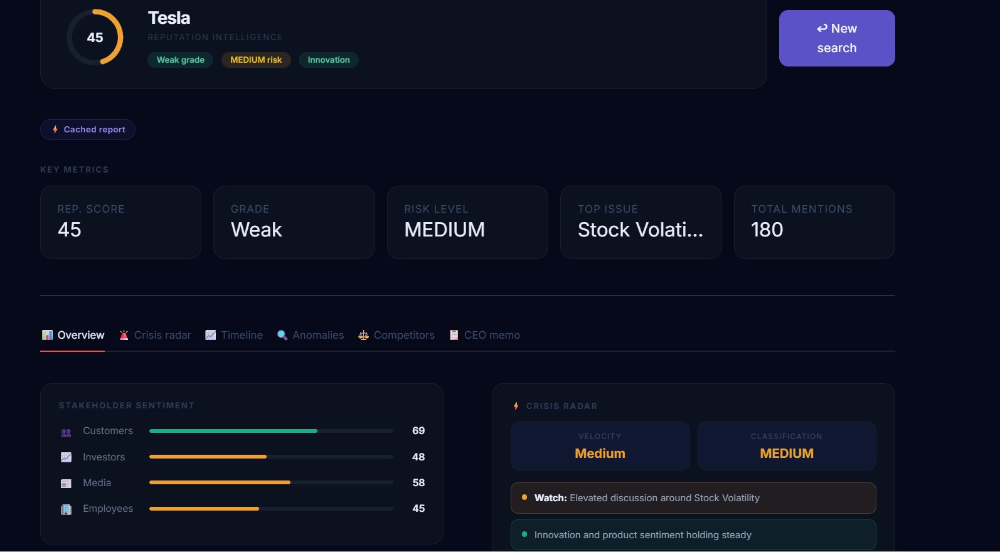
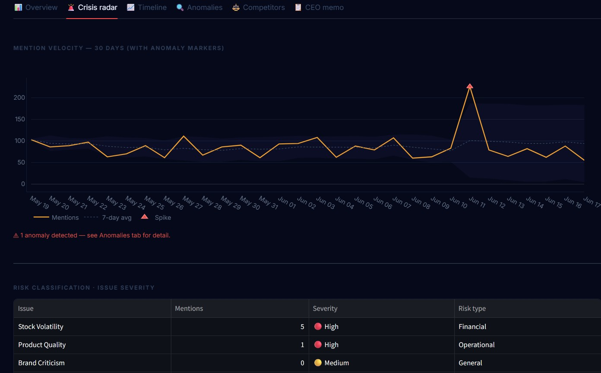
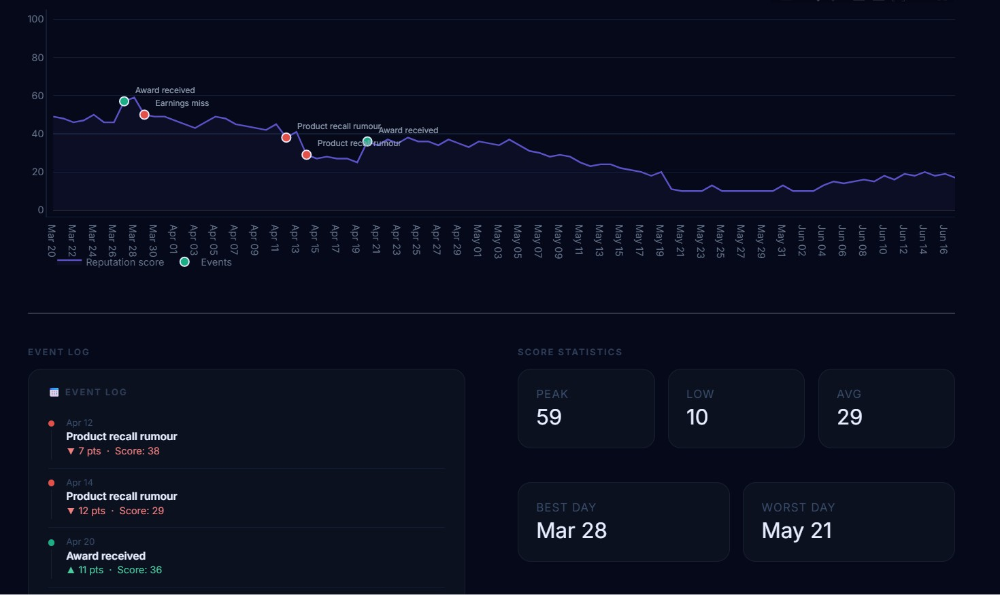
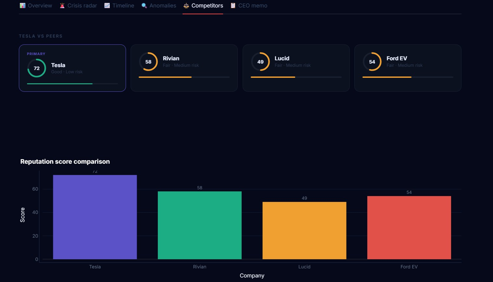
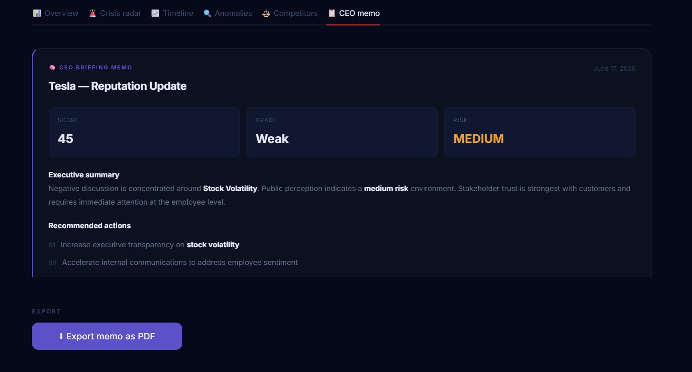

# 🚀 SocialMind AI

### AI-Powered Reputation Intelligence Platform

SocialMind AI is an end-to-end reputation intelligence platform that monitors and analyzes public perception of organizations using AI, NLP, sentiment analysis, and executive-level reporting.

The platform collects information from public sources, evaluates stakeholder sentiment, detects emerging reputation risks, identifies anomalies, and generates executive-ready intelligence dashboards for decision-makers.

---

## 📸 Dashboard Preview

### Landing Page



### Executive Dashboard



### Reputation Analytics



### Executive Briefing



### Risk Monitoring & Trend Analysis



---

# ✨ Features

### Reputation Intelligence

* Company reputation scoring
* Reputation grading system
* Risk classification engine
* Executive reputation overview

### AI & NLP Analytics

* Transformer-based sentiment analysis
* Topic extraction
* Confidence scoring
* Reputation risk detection

### Executive Dashboard

* Executive briefing cards
* Reputation trend monitoring
* Stakeholder sentiment visualization
* Interactive analytics dashboard

### Monitoring & Detection

* Mention velocity tracking
* Anomaly detection
* Reputation history analysis
* Emerging issue monitoring

### Reporting

* Executive summaries
* Cached company analysis
* Interactive visualizations
* PDF report generation

---

# 🏗️ System Architecture

```text
Public Data Sources
        │
        ▼
Data Collection
        │
        ▼
Data Cleaning & Processing
        │
        ▼
Sentiment Analysis
        │
        ▼
Risk Detection
        │
        ▼
Reputation Scoring
        │
        ▼
Executive Intelligence Dashboard
```

---

# 🛠️ Tech Stack

### Frontend

* Streamlit
* Plotly

### Backend

* Python
* Pandas
* NumPy

### AI / NLP

* Hugging Face Transformers
* FinBERT
* Sentiment Analysis Pipelines

### Data Sources

* GNews API
* YouTube Data API

---

# 📂 Project Structure

```text
SocialMindAI/
│
├── app.py
├── README.md
│
├── images/
│   ├── 1.png
│   ├── 2.png
│   ├── 3.png
│   ├── 4.png
│   └── 5.png
│
├── src/
│   ├── analytics/
│   ├── collectors/
│   ├── live_analysis/
│   └── storage/
│
├── data/
│   ├── companies/
│   ├── history/
│   └── live/
│
└── requirements.txt
```

---

# ⚙️ How It Works

1. Enter a company name.
2. Collect public information from online sources.
3. Build a unified company dataset.
4. Run sentiment and reputation analysis.
5. Detect risks and emerging issues.
6. Generate executive insights.
7. Display results through an interactive dashboard.

---

# 📊 Key Capabilities

* AI-powered reputation intelligence
* End-to-end NLP pipeline
* Automated sentiment analysis
* Executive risk monitoring
* Interactive business analytics
* Cached company reports
* Anomaly detection
* Reputation trend analysis

---

# 🚀 Future Enhancements

* Reddit integration
* Twitter/X integration
* Competitor benchmarking
* Reputation forecasting
* Real-time alerts
* Multi-company portfolio monitoring

---

# 👩‍💻 Author

**Roshna**

B.Tech Computer Science Engineering

MNNIT Allahabad

---

### If you found this project interesting, consider giving it a ⭐ on GitHub.
